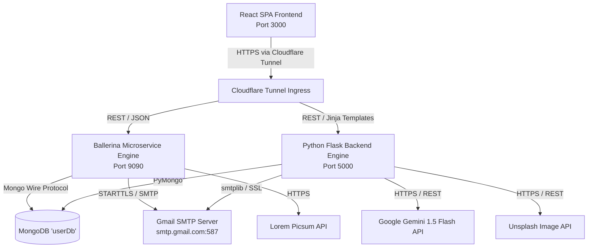
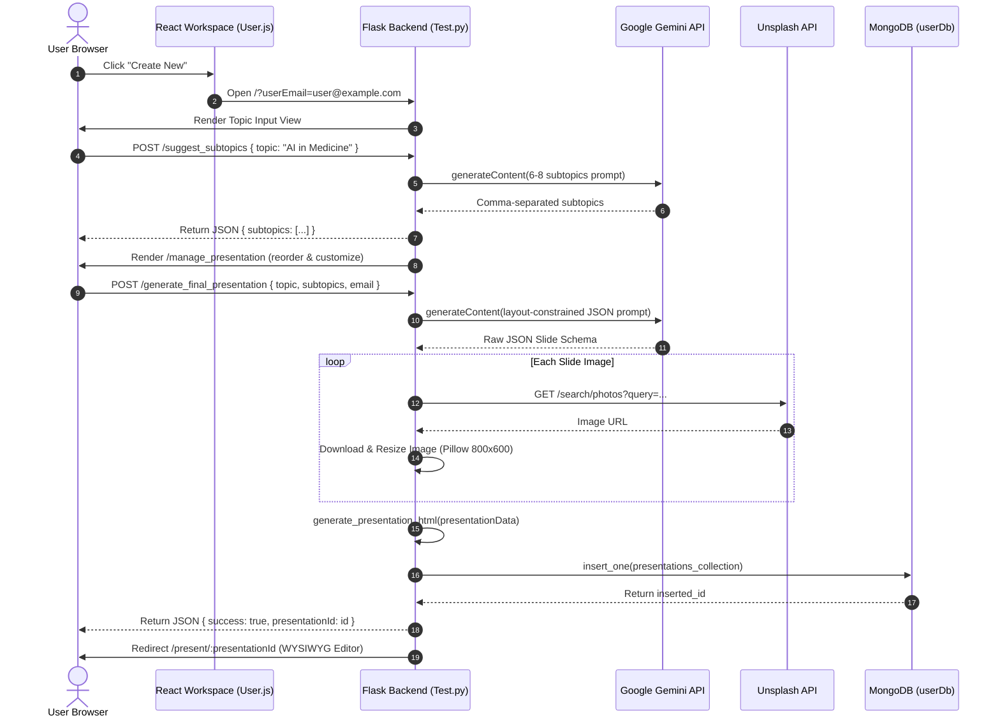

# Webify.me

Webify.me is an AI-powered presentation generation, editing, and sharing web platform built with a React frontend and dual-engine backend services (Ballerina and Python/Flask) for authentication, presentation generation, WYSIWYG editing, collaboration, and administrative communications.

---

## Table of Contents

- [What This Project Does](#what-this-project-does)
- [Project Structure](#project-structure)
- [Frontend Routing](#frontend-routing)
- [Getting Started](#getting-started)
- [Technical Architecture Dossier](#technical-architecture-dossier)
  - [1. Executive Summary & Architecture](#1-executive-summary--architecture)
  - [2. Deep-Dive Tech Stack & Dependencies](#2-deep-dive-tech-stack--dependencies)
  - [3. Object-Oriented Programming (OOP) & Design Patterns](#3-object-oriented-programming-oop--design-patterns)
  - [4. Data Layer, Security & Tenant Isolation](#4-data-layer-security--tenant-isolation)
  - [5. Concurrency, Performance & Memory Management](#5-concurrency-performance--memory-management)
  - [6. Edge Cases, Error Handling & Trade-Offs](#6-edge-cases-error-handling--trade-offs)
- [Key Files & Reference Index](#key-files--reference-index)

---

## What This Project Does

- **AI-Powered Deck Generation:** Converts user topic prompts into structured, multi-slide presentations using Google Gemini (1.5 Flash).
- **Automated Visual Asset Fetching:** Searches and downsamples contextual photography using the Unsplash API.
- **Interactive Slide Editor:** In-browser WYSIWYG drag-and-drop element resizing/positioning via `interact.js`.
- **Client-Side PDF Export:** Instant high-resolution presentation export to PDF using `html2canvas` and `jsPDF`.
- **User Authentication & Profiles:** Account registration, password hashing, session validation, and profile avatar personalization.
- **Collaborative Workspaces:** Real-time presentation sharing via email-based invitation workflows.
- **Community & Trending Showcase:** Public presentation discovery feed with view and like tracking.
- **Admin Communication Hub:** Broadcast transactional email announcements and monitor active user metrics via SMTP.

---

## Project Structure

```text
webify.me/
├── src/                    # React 18 SPA Frontend application
│   ├── Components/
│   │   ├── Introduction/   # Landing page, hero section & typewriter effect
│   │   ├── LogIn/          # User login flow with session persistence
│   │   ├── Signup/         # Registration flow with live debounced validation
│   │   ├── User/           # Main user workspace, presentation dashboard & popovers
│   │   │   ├── Popover/    # Account and email notification dropdowns
│   │   │   └── ProfilePictureModal/ # Modal avatar selector (Lorem Picsum / Unsplash)
│   │   ├── AdminPanel/     # Admin-facing metrics and email broadcast UI
│   │   ├── SlideShow/      # Swiper.js carousel modules (Cards & Coverflow)
│   │   └── utils/          # Client-side session and auth utilities
│   ├── App.js              # React Router v6 routing table
│   ├── index.js            # Entrypoint with WebFontLoader
│   └── config.js           # API base gateway configuration
├── Ballerina_backend/      # High-concurrency Ballerina microservice + MongoDB
│   ├── main.bal            # Ballerina HTTP listeners, MongoDB CRUD & SMTP service
│   ├── Ballerina.toml      # Ballerina package manifest
│   └── Config.toml         # Database and SMTP server configuration
├── Python/                 # Python Flask backend engine & AI pipeline
│   ├── Test.py             # Flask routes, Gemini AI generation, Unsplash & editor templates
│   └── requirements.txt    # Python runtime dependencies
├── public/                 # Static web assets
└── package.json            # Frontend scripts and dependencies
```

---

## Frontend Routing

Main routes defined in `src/App.js`:

- `/` → Introduction & landing page
- `/login` → User authentication page
- `/signup` → User registration page
- `/user` → Workspace dashboard (My Presentations, Favorites, Trending, Notifications)
- `/adminKingSUSL@NirangaKaveeshaIshanGayathri` → Administrator management panel

---

## Getting Started

### 1) Frontend

```bash
npm install
npm start
```

Other available scripts:
```bash
npm run build
npm test
```

### 2) Backend Services

Choose the backend implementation you want to run:

- **Ballerina Backend:** Run from `Ballerina_backend/` using the Ballerina toolchain (`bal run`).
- **Python Backend:** Run from `Python/` after installing dependencies:
  ```bash
  pip install -r Python/requirements.txt
  python Python/Test.py
  ```

Ensure the API base URL in `src/config.js` (and `src/Components/config.js`) points to your active backend gateway (e.g., local port or Cloudflare tunnel).

---

## Technical Architecture Dossier

### 1. Executive Summary & Architecture

* **Core Functionality:**
  Webify.me generates, styles, and renders presentation slide decks from text prompts. Users provide a high-level topic, receive AI-suggested subtopics, configure presentation structure, and trigger structured slide generation. The system orchestrates content generation, image retrieval, server-side HTML compilation, and provides a dynamic in-browser editor with instant PDF export.

* **Architecture Pattern:**
  **Dual-Engine Backend + Client-Side SPA (Hybrid Architecture)**
  - **Frontend:** Single-Page Application (SPA) built with React 18 and React Router v6.
  - **Backend Engine 1 (Ballerina Microservice):** Cloud-native integration service (`Ballerina_backend/main.bal`) handling authentication, profile management, presentation persistence, and SMTP notification broadcasting over non-blocking I/O.
  - **Backend Engine 2 (Python Flask Service):** AI pipeline and dynamic editor engine (`Python/Test.py`) managing Gemini API interactions, Unsplash asset ingestion, image optimization, collaboration workflows, server-side template rendering for interactive slide workspaces, and presentation rendering.
  - **Ingress / Gateway Layer:** Cloudflare Tunnels routing public requests to local backend listener ports (port 9090 for Ballerina, port 5000 for Flask).



* **Component Breakdown & Inter-Module Communication:**
  1. **Authentication & Session Manager (`React SPA & Ballerina / Flask`):**
     Handles registration (`SignUp.js`), login (`LogIn.js`), and client-side session management (`auth.js`, `userUtils.js`) over JSON HTTP POST requests (`/signup`, `/login`, `/checkEmail/:email`, `/checkUsername/:username`).
  2. **User Workspace & Dashboard (`User.js`):**
     Orchestrates user presentations, favorites, trending presentation discovery, notification inbox, and profile picture updates via REST endpoints (`/presentations/:email`, `/trending`, `/notifications/:email`, `/updateProfilePicture`).
  3. **AI Generation Pipeline (`Python/Test.py`):**
     - Step 1: `/suggest_subtopics` calls Gemini to generate 6–8 subtopics from a prompt.
     - Step 2: `/manage_presentation` renders an intermediate UI allowing users to add, reorder, or delete subtopics.
     - Step 3: `/generate_final_presentation` sends structured prompts to Gemini enforcing strict JSON layout rules, queries Unsplash for contextual photography, downloads and resizes images, and persists the generated JSON + HTML to MongoDB.
  4. **Interactive In-Browser Slide Editor (`Python/Test.py`):**
     Dynamic WYSIWYG editor served via `/present/:presentation_id` using `interact.js` for draggable/resizable text/image elements and `html2canvas` + `jsPDF` for client-rendered PDF downloads.
  5. **Collaboration & Notification Subsystem:**
     `POST /collaborations/add` links collaborator emails to a presentation document in `CollabarationDb` and dispatches automated invitation emails via SMTP.
  6. **Admin Panel & Communications Hub (`AdminPanel.js`):**
     Enables global email broadcasting and telemetry aggregation via `/admin/sendEmailNotification`, `/admin/notifications`, `/users`, and `/users/active_count`.

---

### 2. Deep-Dive Tech Stack & Dependencies

* **Core Languages & Runtimes:**
  - **JavaScript (ECMAScript 6+) / Node.js:** Frontend runtime powered by React 18.
  - **Ballerina (Swan Lake 2201.8.0):** Cloud-native statically typed programming language designed for network integration and microservices (`Ballerina.toml`).
  - **Python 3.10+:** Backend scripting, AI orchestration, image processing, and templated HTML presentation rendering (`Python/requirements.txt`).

* **Frameworks & Core Libraries:**
  - **Frontend:**
    - `react` (v18.2.0), `react-dom` (v18.2.0)
    - `react-router-dom` (v6.8.0): Client-side declarative routing (`src/App.js`).
    - `@mui/material` (v5.18.0), `@emotion/react` (v11.14.0), `@emotion/styled` (v11.14.1): Material Design components (Grid, Box, Tabs, Popover).
    - `swiper` (v11.2.10): Slide carousels using `EffectCards` and `EffectCoverflow` modules (`SlideShow.js`, `SlideShow_2.js`).
    - `react-icons` (v5.5.0): Vector icons (`Fa`, `Md`, `Io`).
    - `webfontloader` (v1.6.28): Async Google Font loading (`src/index.js`).
  - **Python Backend:**
    - `Flask` (v3.1.1), `Werkzeug` (v3.1.3), `Jinja2` (v3.1.6): Web framework and template engine.
    - `flask-cors` (v6.0.1): Cross-Origin Resource Sharing handling.
    - `pymongo` (v4.14.0): MongoDB driver.
    - `Pillow` (v11.3.0): Server-side image thumbnailing and optimization.
    - `requests` (v2.32.3): HTTP client for upstream REST calls.
    - Client-side Injections: `interact.js` (drag/resize), `jspdf` (v2.5.1), `html2canvas` (v1.4.1), Tailwind CSS CDN.
  - **Ballerina Backend:**
    - `ballerina/http`: HTTP listener and client bindings.
    - `ballerinax/mongodb`: MongoDB native connector module.
    - `ballerina/crypto`: Cryptographic hashing (SHA-256).
    - `ballerina/email` & `ballerina/mime`: Transactional email delivery with HTML MIME multipart encoding.
    - `ballerina/uuid` & `ballerina/time`: UUID v1 generator and UTC timestamping.

* **External APIs & Integrations:**
  - **Google Gemini API (`gemini-1.5-flash-latest`):** Invoked at `https://generativelanguage.googleapis.com/v1beta/models/gemini-1.5-flash-latest:generateContent` using structured generation (`temperature: 0.7`, `responseMimeType: application/json`) to create structured presentation schemas (`Test.py`).
  - **Unsplash API (`https://api.unsplash.com/search/photos`):** Automated keyword-based image retrieval with landscape orientation filtering (`Test.py`).
  - **Lorem Picsum API (`https://picsum.photos`):** Dynamic avatar generation based on base64-hashed email seeds (`main.bal`).
  - **Google Gmail SMTP (`smtp.gmail.com:587`):** Encrypted email dispatching via TLS/STARTTLS authentication.

---

### 3. Object-Oriented Programming (OOP) & Design Patterns

* **OOP Principles in Practice:**
  - **Encapsulation:**
    - React Class Components (`User`, `AdminPanel`, `LogIn`, `SignUp`, `ProfilePictureModal`) encapsulate internal state boundaries (`anchorEl`, `favorites`, `presentations`, `apiKeys`, `pictureOptions`) behind private state and updater methods.
    - `SimpleAuth` (`src/Components/utils/auth.js`) encapsulates `localStorage` parsing, session expiry checks, and session validation behind static class methods (`isLoggedIn()`, `validateSession()`, `protectPage()`).
  - **Inheritance & Polymorphism:**
    - Component Inheritance: `User`, `SignUp`, `LogIn`, `AdminPanel` inherit from `React.Component`, overriding lifecycle hooks `componentDidMount()`, `componentWillUnmount()`, and polymorphic `render()`.
    - UI Polymorphism: `CustomTabPanel` renders polymorphic child components dynamically depending on the current tab index (`value === index`).
  - **Abstraction:**
    - Network & Driver Abstraction: Ballerina's `email:SmtpClient` and `mongodb:Client` abstract TCP/TLS socket connections and wire protocols into typed method invocations (`smtpClient->sendMessage()`, `usersCollection->insertOne()`).
    - Presentation Rendering Abstraction: `generate_presentation_html()` (`Test.py`) abstracts slide JSON objects into standalone CSS-styled DOM trees without exposing document tree creation details to controllers.

* **Design Patterns Used:**
  - **Facade Pattern:** `src/Components/utils/userUtils.js` and `auth.js` provide simplified facades over browser storage APIs (`localStorage`, `sessionStorage`), session expiry calculations, and profile picture resolution fallbacks.
  - **Exponential Backoff & Retry Pattern:** Implemented in `api_call_with_backoff()` (`Test.py`) with exponential delay calculation (`initial_delay * (2 ** i)`) and timeout management (`timeout=180`) to handle Gemini API rate limits.
  - **Compensating Transaction / Rollback Pattern:** Demonstrated in Ballerina signup endpoint (`main.bal`): If writing to `userDataCollection` fails after inserting into `usersCollection`, an explicit compensating delete (`usersCollection->deleteOne({"email": user.email})`) is executed to maintain database consistency.
  - **Dual-Engine / Migration Adapter Pattern:** Identical REST route signatures and JSON schemas are maintained between Ballerina (`main.bal`) and Python Flask (`Test.py`), allowing backend engines to be swapped without requiring React frontend modifications.
  - **Portal Pattern:** Implemented in `ProfilePictureModal.js` using `ReactDOM.createPortal(..., document.body)` to decouple modal overlays from the parent DOM tree hierarchy.
  - **Debounce Pattern:** Implemented with `setTimeout` / `clearTimeout` in `SignUp.js` to throttle live API queries during email and username validation typing.

---

### 4. Data Layer, Security & Tenant Isolation

* **Database & Storage (MongoDB):**
  - **Database Name:** `userDb`
  - **Collection Schemas & Relationships:**
    - **`users`:** Core identity document (`email`, `username`, `password` SHA-256 hash, `createdAt`, `lastLogin`, `authMethod`, `picture`, `pictureId`, `emailVerified`).
    - **`userData`:** Extended user profile metadata (`email`, `username`, `picture`, `pictureId`, `bio`, `location`, `phoneNumber`).
    - **`presentations`:** Presentation storage supporting soft-deletion (`email`, `presentationName`, `presentationData`, `code` raw HTML, `previewImageUrl`, `createdAt`, `updatedAt`, `isActive`).
    - **`CollabarationDb`:** Multi-tenant collaboration mapping (`presentationId`, `ownerEmail`, `collaboratorEmails`, `createdAt`, `isActive`, `label`).
    - **`Trending`:** Community presentation showcase with engagement counters (`views`, `likes`, `category`, `isFeatured`).
    - **`admin` / `adminMessages` / `notificationCounter`:** Administrative credentials, global notification broadcasts, and per-user unread counters.

* **Security & Auth:**
  - **Password Storage:** One-way cryptographic hashing using SHA-256 (`main.bal`, `Test.py`).
  - **Session Validation:** Client-side sliding-window TTL validation checking `loginTime` timestamp against a 24-hour expiration threshold (`userUtils.js`, `auth.js`).
  - **Tenant Isolation & IDOR Protection:**
    - In the Ballerina backend, presentation operations enforce strict ownership criteria:
      ```ballerina
      map<json> filter = {"_id": presentationId, "userEmail": userEmail, "isActive": true};
      ```
      This ensures users cannot view, rename, or delete presentations belonging to other tenants.
    - In the Python backend, presentation access aggregates owned items and validated shared collaborations via `$in` query filtering (`Test.py`).

* **Data Flow (End-to-End Presentation Creation Lifecycle):**



---

### 5. Concurrency, Performance & Memory Management

* **Resource Optimization:**
  - **Image Downsampling & Compression:** Incoming Unsplash images are streamed in 1024-byte chunks and processed via Pillow (`Image.thumbnail((800, 600))`) before being written to disk (`Test.py`), preventing unconstrained disk usage and high bandwidth overhead.
  - **Normalized Responsive Slide Engine:** Coordinate positioning in Gemini prompts is strictly constrained to percentage units (`x: 4%`, `y: 20%`, `width: 43%`, `height: 50%`) (`Test.py`), eliminating server-side rendering calculations and offloading responsive scaling to client CSS.
  - **Non-blocking Font Loading:** Google Fonts are loaded asynchronously via `webfontloader` in `index.js`, preventing render-blocking layout shifts (CLS).

* **Concurrency Model:**
  - **Ballerina Concurrency (Strand-based Event Loop):** Uses cooperative multitasking on top of worker threads (strands). Non-blocking network I/O allows concurrent connections to stream MongoDB cursors (`stream<UserDocument, mongodb:Error?>`) and dispatch SMTP emails without thread pool starvation.
  - **Python Flask Concurrency:** Synchronous WSGI execution model. Upstream API calls are protected by socket timeouts (`timeout=180` in requests) and retry loops.
  - **Client-side Non-blocking Architecture:** Uses native ES6 `async`/`await` for network requests and DOM debouncing to keep the main JavaScript thread responsive during user typing and tab transitions.

---

### 6. Edge Cases, Error Handling & Trade-Offs

* **Resilience & Fault Tolerance:**
  - **API Rate-Limiting & Network Drops:** `api_call_with_backoff()` intercepts network exceptions (`requests.exceptions.RequestException`, `HTTPError`) and executes exponential backoff across 5 retries (`Test.py`).
  - **Missing / Invalid API Keys:** If `UNSPLASH_ACCESS_KEY` is missing or invalid, the system falls back to a placeholder generator (`https://placehold.co/600x400/...`) rather than failing the presentation generation flow (`Test.py`).
  - **Database Rollback:** Ballerina signup service executes compensating deletions to prevent orphaned user records if secondary profile insertions fail (`main.bal`).
  - **Soft-Deletion Strategy:** Presentation deletions use soft-deletion (`isActive: false`, `deletedAt: timestamp`) (`Test.py`), allowing audit trails and recovery.

* **Technical Trade-Offs & Architecture Critique:**

| Design Choice | Benefit | Trade-Off / Technical Debt | Recommended Production Refactoring |
| :--- | :--- | :--- | :--- |
| **Dual Backend Engines (Ballerina + Flask)** | Allows comparing Ballerina's integration capabilities with Python's AI/image ecosystem. | Duplicates business logic and database models; requires maintaining two separate services. | Consolidate into a single backend (e.g., Python FastAPI or Node/NestJS) with clear modular domains. |
| **Client-Side PDF Generation (`html2canvas` + `jsPDF`)** | Zero server CPU and memory overhead; PDF rendering scales directly on client devices. | Output quality varies across browsers, device GPUs, and screen pixel ratios. | Offload to an asynchronous headless browser worker pool (e.g., Puppeteer / Chromium on AWS Lambda). |
| **Inline HTML Storage (`code` field in MongoDB)** | Presentations can be rendered directly via `/presentations/view/:id` without dynamic reconstruction. | HTML data redundancy; changes to global slide styles do not propagate to existing presentations. | Store only canonical JSON schemas in MongoDB; render HTML dynamically through a shared template component. |
| **Client-Side Expiration (`authData` in `localStorage`)** | Eliminates server-side session stores (Redis) and database lookups for session validation. | Vulnerable to XSS token theft; cannot immediately invalidate compromised sessions server-side. | Implement HTTP-only, Secure, SameSite JWT access/refresh tokens with server-side revocation lists. |

---

### Key Files & Reference Index

* **Frontend:**
  - Application Routes: `src/App.js`
  - User Workspace & Dashboard: `src/Components/User/User.js`
  - Admin Management Panel: `src/Components/AdminPanel/AdminPanel.js`
  - Registration & Live Validation: `src/Components/Signup/SignUp.js`
  - Login & Remember Me: `src/Components/LogIn/LogIn.js`
  - Authentication Utilities: `src/Components/utils/auth.js` & `src/Components/utils/userUtils.js`
* **Backend:**
  - Ballerina HTTP & MongoDB Service: `Ballerina_backend/main.bal`
  - Python Flask Engine & AI Pipeline: `Python/Test.py`
